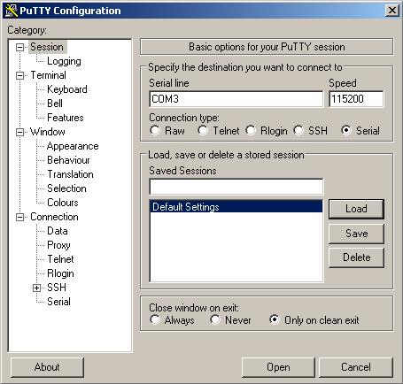

# Отладочная консоль на Orange Pi3 LTS


При настройке одноплатных компьютеров, работающих под управлением операционных систем на основе ядра Linux
(Armbian, Debian, Android и прочие) может оказаться весьма полезным подключить одноплатник к большому брату (настольному компьютеру или ноутбуку)
через отладочную консоль.

Отладочная консоль при начальной настройке позволяет обойтись без дополнительного монитора с клавиатурой, без подключения ethernet, и без необходимости править образ файловой системы на SD,
задавая wifi ssid/пароль ДО первого старта.

Также может оказать помощь в диагностике проблем, если одноплатник "вдруг" перестал загружаться.

## Немного теории
Отладочная консоль смотрит в мир через последовательный интерфейс UART, часто называемый DEBUG UART. На многих одноплатных компьютерах отладочный UART явно выделен
(например, Orange Pi3 LTS), на других его требуется активировать вручную (Raspberry Pi). 

Соединив DEBUG UART с большим компьютером и подключившись к нему терминальной программой, получаем удалённый терминал в духе классических UNIX-машин,
имеем возможность читать сообщения ядра при загрузке, а также залогиниться и получить командную строку.

Современные компьютеры для работы с UART используют преобразователи интерфейса UART-USB, чаще всего построенные на микросхемах FT232, PL2303, CP2102 или CH340.

## Примеры готовых модулей UART-USB преобразователей

CP2102 https://aliexpress.ru/item/32694152202.html

CH340 https://aliexpress.ru/item/32529737466.html

К покупке рекомендуются модули на основе CP2102, как оптимальные по отношению цена/качество, и не имеющие сложностей с установкой драйверов.

## Схема подключения UART-USB преобразователя к Orange Pi3 LTS


### Таблица соединений

| CP2102 | OPI3LTS |
|--------|---------|
| RX     | TX      |
| TX     | RX      |
| GND    | GND     |

Для подключения потребуются 3  DUPONT-проводника.

ОБРАТИТЕ ВНИМАНИЕ, что линии RX и TX подключены перекрёстно, TX одноплатника к RX uart-преобразователя, а RX одноплатника к TX uart-преобразователя.

## Настройка терминальной программы

### Windows и PuTTY

Для Windows одна из самых простых терминальных программ - PuTTY (всё равно её придётся ставить для доступа по SSH)

После подключения UART-USB преобразователя к Windows-машине нужно узнать номер COM-порта через диспетчер устройств,
затем его прописать в настройках PuTTY, не забыв указать скорость соединения 115200:



Далее включаем Orange Pi (если ещё не включили), и пользуемся терминальным доступом.

### Linux и picocom

Для пользователей Linux на "большом брате" я рекомендую использовать программу picocom.

После подключения UART-USB преобразователя к USB-порту Linux-машины нужно узнать адрес порта

```console
$ ls /dev/serial/by-id/ -l
lrwxrwxrwx 1 root root 13 дек 19 18:23 usb-Silicon_Labs_CP2102_USB_to_UART_Bridge_Controller_0001-if00-port0 -> ../../ttyUSB0
```

Подключаемся
```console
$ picocom -b 115200 /dev/serial/by-id/usb-Silicon_Labs_CP2102_USB_to_UART_Bridge_Controller*
```

Для завершения программы picocom нажимаем последовательность ^A ^Q
