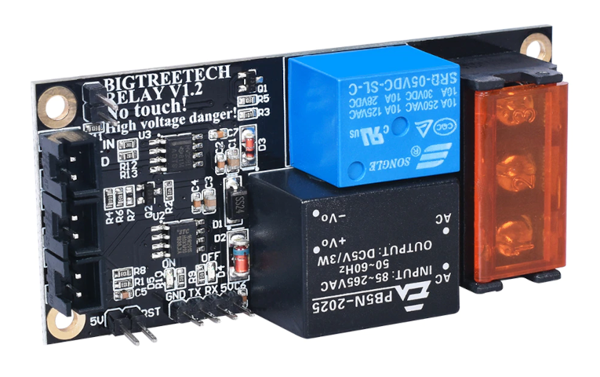

!!! WORK IN PROGRESS !!!

# Управление питанием системы, содержащей одноплатный компьютер Raspberry PI

Содержимое статьи подходит для одноплатных компьютеров Raspberry Pi 3b, 3b+, 4b. Совместимость с ранними моделями не изучалась.

Основная цель - управление питанием в стиле ATX PC, а именно - корректное завершение работы с обесточиванием системы, включая SBC и 3д-принер, 
после сброса кэшей записи и размонтирования файловой системы.


**ВНИМАНИЕ!** **ОПАСНО ДЛЯ ЖИЗНИ!** Действия, описываемые в данной статье, подразумевают вмешательство в электрическую часть системы (3д-принтера), 
напрямую подключаемую к электрической сети 230В. Все манипуляции, связанные с подключением проводов, проводить на обесточенной системе! 
Сетевой шнур должен быть вынут из розетки. Если вы не обладаете знаниями, навыками и допуском к работе с электроустановками, 
обратитесь к специалисту для выполнения описанных модификаций.

## Предварительные требования:

Данное руководство предполагает, что одноплатный компьютер Raspberry Pi питается от основного блока питания принтера 24В через понижающий преобразователь.
(В вариантах с независимым от принтера питанием одноплатного компьютера действия, описанные в этом руководстве, малоприменимы)

Также предполагается, что основные настройки Raspbian и klipper уже сделаны, либо используется специализированный образ FluiddPi или MainsailOs

Для управления модулем реле должен быть свободен один из выводов GPIO, в рамках статьи предлагается использовать линию GPIO26


## Необходимое железо

В качестве исполнительного устройства, выключающего питание системы, предлагается использовать BTT Relay https://aliexpress.ru/item/4000180758289.html

 

Основная характеристика реле, обеспечившая его выбор (а не похожее MKS PWC) - задержка включения/выключения 15 секунд, позволяющая загрузить ядро Linux 
с необходимыми оверлеями без необходимости зажимать на это время (около 5 секунд) кнопку включения.

Основной недостаток - реле включает нагрузку по умолчанию, при начальной подаче сетевого напряжения 230В или пропадания сетевого напряжения.

Подробно работа данного реле рассмотрена в статье https://3dtoday.ru/blogs/vasilius-v/reversing-modulya-rele-bigtreetech-relay-v12

Возможно использование других реле, удовлетворяющих основному требованию - задержке выключения 10-15 секунд при отсутствии управляющего сигнала

## Настройка управления питанием через GPIO одноплатного компьютера

Убедитесь в наличии готового оверлея gpio-poweroff:
```console 
ls /boot/overlays/gpio-poweroff.dtbo
```
```console
/boot/overlays/gpio-poweroff.dtbo
```
Оверлей присутствует во всех дистрибутивах, основанных на Raspbian

Также можно почитать встроенное описание данного оверлея
```console 
dtoverlay -h gpio-poweroff
```
```console
Name:   gpio-poweroff

Info:   Drives a GPIO high or low on poweroff (including halt). Using this
        overlay interferes with the normal power-down sequence, preventing the
        kernel from resetting the SoC (a necessary step in a normal power-off
        or reboot). This also disables the ability to trigger a boot by driving
        GPIO3 low.

        Users of this overlay are required to provide an external mechanism to
        switch off the power supply when signalled - failure to do so results
        in a kernel BUG, increased power consumption and undefined behaviour.

Usage:  dtoverlay=gpio-poweroff,<param>=<val>

Params: gpiopin                 GPIO for signalling (default 26)

        active_low              Set if the power control device requires a
                                high->low transition to trigger a power-down.
                                Note that this will require the support of a
                                custom dt-blob.bin to prevent a power-down
                                during the boot process, and that a reboot
                                will also cause the pin to go low.
        input                   Set if the gpio pin should be configured as
                                an input.
        export                  Set to export the configured pin to sysfs
        timeout_ms              Specify (in ms) how long the kernel waits for
                                power-down before issuing a WARN (default 3000).
```

Добавляем следующую строку в файл config.txt. Укажем, что используем пин GPIO26, и что для выключения пин должен быть в состоянии логического нуля:
```console
dtoverlay=gpio-poweroff,gpiopin=26,active_low
```

Это можно сделать либо через текстовый редактор, либо такой командой:
(В старых raspbian)
```console
echo "dtoverlay=gpio-poweroff,gpiopin=26,active_low" | sudo tee -a /boot/config.txt
```

Начиная с версий Bookworm config.txt переехал в /boot/firmware :
```console
echo "dtoverlay=gpio-poweroff,gpiopin=26,active_low" | sudo tee -a /boot/firmware/config.txt
```

Перезагружаемся
```console
sudo reboot
```
(Опционально) Проверяем результат. (требуется установка wiringpi http://wiringpi.com/ )
Внимание! У wiringpi своя нумерация, смотреть на номер в столбце BCM (26)
```console 
$ gpio readall
```
 


## Подробности реализации

Оверлей gpio-readal загружается и стартует сразу после запуска ядра Linux. Оверлей настраивает выбранный пин (в нашем примере - GPIO26) 
в режим OUT и переводит в состояние логической 1. 

При завершении работы после остановки ядра оверлей вместо выполнения сброса SoC переключает GPIO26 в состояние 0 и переходит в бесконечный цикл,
который будет прерван снятием питания со всей системы, включая Raspberry Pi.

Появление лог.0 на выводе GPIO26 приведёт к срабатыванию BTT Relay, которое обесточит систему через 15 секунд.


**ВНИМАНИЕ!** Измененение состояния пина GPIO26 в 0 или IN прямым доступом также приведёт к выключению питания системы через 15 секунд, 
в соответствии с логикой работы платы BTT Relay.


Штатно система выключается командой 
```console
sudo poweroff
```
а также соответствующей кнопкой веб-интерфейса Fluidd или Moonraker

## Подключение реле

После установки оверлея можно приступать к сборке схемы управления питанием.

 

**ВНИМАНИЕ!** **ОПАСНО ДЛЯ ЖИЗНИ!** Нижеописываемые действия проводить строго на обесточенном устройстве, сетевой шнур должен быть вынут из розетки.

***ВНИМАНИЕ!** Контакты платы BTT Relay находятся под напряжением относительно корпуса прибора! По действующим стандартам, расстояние от токоведущих элементов до корпуса должно быть не менее 8мм (устанавливать плату на стойки высотой 10мм), либо необходимо обеспечить дополнительную изоляцию - поместить BTT Relay в изолирующий корпус.

[Корпус для установки платы BTT_Relay](BTT_Relay_Enclosure.stl)


**ВНИМАНИЕ!** При отсутствии оверлея линия управления питания включённого устройства останется сконфигурированной как вход, будет восприниматься BTT_RELAY как сигнал выключения, и через 15 секунд питание с системы, в т.ч. с одноплатника будет снято! При отладке, чтобы не разбирать схему, достаточно вместо кнопки включения поставить джампер.

### Схема подключения
Подключение модуля реле выполняется согласно схеме. Преобразователь DC/DC 24В->5В на основе MP1584EN выбран условно. Такого преобразователя хватает для питания одноплатника и простой вебкамеры. Если планируется использовать более тяжёлые нагрузки, вроде адресных светодиодных лент, требуется более придирчиво выбирать преобразователь, вплоть до перехода на AC/DC.


Силовые клеммы реле LIN, LOUT включаются в разрыв сетевого провода L 230В источника питания;
Клемма реле N соединяется с одноимённой клеммой N источника питания;

Кнопка включения системы подключается к разъёму BTT Relay RST, сигнал удержания питания - к разъёму PS_ON_IN.

Со стороны SBC сигнал удержания питания подключается к GPIO26 (пин 37 гребёнки GPIO)
Также необходимо соединить землю GND SBC (например, пин 39 гребёнки GPIO).

**ВНИМАНИЕ!** при подключении двухпроводной линии управления питанием соблюдать полярность как со стороны SBC, так и на плате BTT RELAY. См. схему (TODO).


продолжение следует...
TODO добавить примеры настройки клиппера


