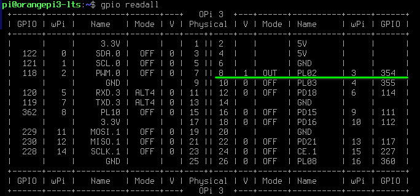

# Управление питанием системы, содержащей одноплатный компьютер Orange Pi3 LTS

Основная цель - управление питанием в стиле ATX PC, а именно - корректное завершение работы с обесточиванием системы, включая SBC, после сброса кэшей записи и размонтирования файловой системы.

*ВНИМАНИЕ! ОПАСНО ДЛЯ ЖИЗНИ! Действия, описываемые в данной статье, подразумевают вмешательство в электрическую часть системы (3д-принтера), напрямую подключаемую к электрической сети 230В. Все манипуляции, связанные с подключением проводов, проводить на обесточенной системе! Сетевой шнур должен быть вынут из розетки. Если вы не обладаете знаниями, навыками и допуском к работе с электроустановками, обратитесь к специалисту для выполнения описанных модификаций.

## Необходимое железо

В качестве исполнительного устройства, выключающего питание системы, предлагается использовать BTT Relay https://aliexpress.ru/item/4000180758289.html

 
Основная характеристика реле, обеспечившая его выбор (а не похожее MKS PWC) - задержка включения/выключения 15 секунд, позволяющая загрузить ядро Linux 
с необходимыми оверлеями без необходимости зажимать на это время (около 5 секунд) кнопку включения.

Основной недостаток - реле включает нагрузку по умолчанию, при начальной подаче сетевого напряжения 230В или пропадания сетевого напряжения.

Подробно работа данного реле рассмотрена в статье https://3dtoday.ru/blogs/vasilius-v/reversing-modulya-rele-bigtreetech-relay-v12

Возможно использование других реле, удовлетворяющих основному требованию - задержке выключения 10-15 секунд при отсутствии управляющего сигнала

## Настройка управления питанием через GPIO одноплатного компьютера

Перед подключением реле необходимо скомпилировать оверлей gpio-poweroff.

Устанавливаем необходимые зависимости
```console
$ sudo apt install git build-essential linux-headers-current-sunxi64
```

Скачать файл gpio-poweroff.dts в домашнюю директорию и скомпилировать
```console
$ cd ~
$ wget (todo)
$ sudo armbian-add-overlay gpio-poweroff.dts
$ reboot
```

Проверить правильность результата сборки оверлея можно командой
```console
$ gpio readall
```
Пин PL2 должен быть сконфигурирован (Mode) как выход OUT и прочитываться (V) в состоянии лог. единицы:
 

## Подробности реализации

Оверлей создаёт объект "светодиод", подключённый к GPIO PL2, инициализируемый и зажигаемый в момент загрузки оверлея.
Светодиод будет "светиться" во время нормальной работы платы и будет "погашен" в самом конце завершения работы по команде poweroff.

Также светодиод может быть "погашен" доступом к пину через sysfs:
```console
$ echo "0" | sudo tee /sys/class/leds/key-pwc/brightness
```
иил через интерфейс gpiod:
```console
$ gpio write 3 0
```
TODO: пример форсированного выключения через klipper.

*ВНИМАНИЕ! Выключение пина PL2 прямым доступом приведёт к выключению питания системы через 15 секунд, в соответствии с логикой работы платы BTT Relay.


Штатно система выключается командой 
```console
sudo poweroff
```
а также соответствующей кнопкой веб-интерфейса Fluidd или Moonraker

## Подключение реле

После установки оверлея можно приступать к сборке схемы управления питанием.

*ВНИМАНИЕ! ОПАСНО ДЛЯ ЖИЗНИ! Нижеописываемые действия проводить строго на обесточенном устройстве, сетевой шнур должен быть вынут из розетки.

*ВНИМАНИЕ! Контакты платы BTT Relay находятся под напряжением относительно корпуса прибора! По действующим стандартам, расстояние от токоведущих элементов до корпуса должно быть не менее 8мм, либо необходимо обеспечить дополнительную изоляцию - поместить BTT Relay в изолирующий корпус

*ВНИМАНИЕ! При отсутствии оверлея линия управления питания включённого устройства останется сконфигурированной как вход, будет восприниматься BTT_RELAY как сигнал выключения, и через 15 секунд питание с системы, в т.ч. с одноплатника будет снято! При отладке, чтобы не разбирать схему, достаточно вместо кнопки включения поставить джампер.

Силовые клеммы реле включаются в разрыв сетевого провода 230В источника питания.
Кнопка включения системы подключается к разъёму BTT Relay RST, сигнал удержания питания - к разъёму PS_ON_IN.

Со стороны SBC сигнал удержания питания подключается к PL2 (пин 8 гребёнки GPIO, теряем функцию STX)
Также необходимо соединить землю GND SBC (например, пин 6 гребёнки GPIO).
ВНИМАНИЕ! при подключении двухпроводной линии управления питанием соблюдать полярность как со стороны SBC, так и на плате BTT RELAY. См. схему (TODO).


